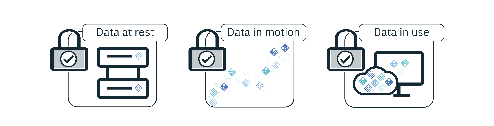
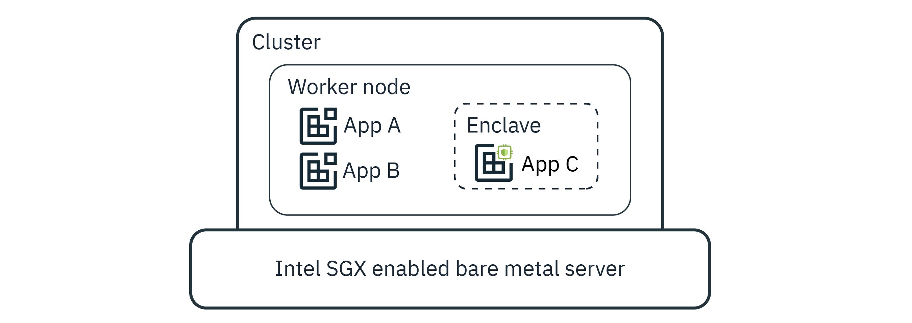

---

copyright:
  years: 2018, 2021
lastupdated: "2021-04-21"

keywords: confidential computing, secure data, encryption, Fortanix, runtime encryption, memory, encrypt, app security, private data, Intel, SGX, convert, protect, data in use, data protection, containerized apps,

subcollection: data-shield
---

{:codeblock: .codeblock}
{:screen: .screen}
{:download: .download}
{:external: target="_blank" .external}
{:faq: data-hd-content-type='faq'}
{:gif: data-image-type='gif'}
{:important: .important}
{:note: .note}
{:pre: .pre}
{:tip: .tip}
{:preview: .preview}
{:deprecated: .deprecated}
{:beta: .beta}
{:term: .term}
{:shortdesc: .shortdesc}
{:script: data-hd-video='script'}
{:support: data-reuse='support'}
{:table: .aria-labeledby="caption"}
{:troubleshoot: data-hd-content-type='troubleshoot'}
{:help: data-hd-content-type='help'}
{:tsCauses: .tsCauses}
{:tsResolve: .tsResolve}
{:tsSymptoms: .tsSymptoms}
{:java: .ph data-hd-programlang='java'}
{:javascript: .ph data-hd-programlang='javascript'}
{:swift: .ph data-hd-programlang='swift'}
{:curl: .ph data-hd-programlang='curl'}
{:video: .video}
{:step: data-tutorial-type='step'}
{:tutorial: data-hd-content-type='tutorial'}

# About the service
{: #about}

With {{site.data.keyword.datashield_full}}, Fortanix®, and Intel® SGX you can protect the data in your containerized workloads that run on {{site.data.keyword.containershort}} and {{site.data.keyword.openshiftshort}} clusters while your data is in use.
{: shortdesc}

{: video output="iframe" data-script="#transcript-about" id="mediacenterplayer" frameborder="0" width="560" height="315" allowfullscreen webkitallowfullscreen mozAllowFullScreen}

## Video transcript
{: #transcript-about}
{: notoc}

In today's digital global economy data is one of the most valuable assets of enterprises. Data must be protected throughout its lifecycle - when at rest, when in motion, and in use. {{site.data.keyword.cloud_notm}} Security Services have you covered by managing access to your resources, protecting your data, and providing you with insightful visibility into your security environment. Today we're going to focus on the all important protection of data in use. With Data Shield, your app code and data run in CPU hardened enclaves, which are trusted areas of memory on the worker node that protect the critical aspects of your apps. Let's look at how Data Shield helps customers protect their data in use.

So, you're developing a new banking service that deals with sensitive user information and financial data. You've been working with your team for weeks to bake in security to the product from the ground up to establish parameter security so no one has physical access to the Kubernetes cluster that you're running. You've set it up so that only Ingress on Kubernetes was exposed on the public network. Network policies between pods restrict communication. Cloud Internet services provides a firewall and protection from DDoS attacks. Key Protect stores encryption keys. There's encryption at rest and the public endpoints are served over a secure connection.

With all these measures, the team makes sure the data that flows through the service is protected at rest and in transit through encryption. However the data is still exposed in plain text while in use or runtime and remains vulnerable to privileged user attacks. Data Shield bridges the gap in today's protection measures by bringing runtime memory encryption to data in use.

Your team understands that the backend API was still exposed to privileged users and the vulnerabilities that come with it. You've explored the options and discovered that Intel SGX as a potential solution where the application runs encrypted in memory. However, your team didn't have the competency or time to learn Intel SGX in order to re-engineer their current application that they developed to leverage Intel SGX. The team then learned about Data Shield and built a quick proof of concept by installing the Helm chart on their target Kubernetes cluster.

They were able to demonstrate the value by simulating a privileged user attack by memory dumping the application and scrapping for text. This time, they didn't see any plain text in the memory. Data Shield helped your team convert your existing backend into a shielded or runtime memory encrypted counterpart in a few minutes. And, they were able to automate the conversion through their DevOps integration. Finally, they were able to deploy a new backend API in less than 15 minutes. Your team has now managed to protect data at rest, in transit, and in use.

## Types of encryption
{: #encryption-types}

{: caption="Figure 1. Types of encryption" caption-side="bottom"}

When it comes to protecting your data, encryption is one of the most popular and effective controls. But, the data must be encrypted at each step of its lifecycle for your data to really be secure. During its lifecycle, data has three phases. It can be at rest, in motion, or in use. Data at rest and in motion are generally the area of focus when you think of securing your data. But, after an application starts to run, data that is in use by CPU and memory is vulnerable to various attacks. The attacks might include malicious insiders, root users, credential compromise, OS zero-day, network intruders, and others. Enter - Data Shield.

## How it works
{: #architecture}

With Data Shield, you can secure your data while it is in use.

{: caption="Figure 2. Cluster set up" caption-side="bottom"}

On your worker node, you might have several different applications running at the same time. To fully secure your app data, you can run any of the apps that handle sensitive information within an enclave. Enclaves are trusted areas of memory that keep code and data confidential and secure. The information in the enclave cannot be read or modified in anyway by anything outside the enclave - including processes that run at higher privilege levels.

Data Shield achieves this level of security by establishing trust through Elliptic Curve Digital Signature Algorithm (ECDSA)-based remote attestation. An attestation report provides information like the identity of the software, details of an execution, and an assessment of any possible software tampering. After the enclave establishes trust, an encrypted communication channel is established.

If you or your company require data sensitivity because of internal policies, government regulations, or industry compliance requirements, this solution might help you to move to the cloud.

## Integrated technologies
{: #integrations}

Data Shield is built by combining several technologies.

<dl>
  <dt>Intel SGX</dt>
    <dd>With <a href="https://software.intel.com/en-us/sgx" target="_blank" class="external">Intel SGX</a>, which is an extension to the x86 architecture, you can run applications in a fully isolated, secure enclave. Because it is only offered on a bare metal server, the application isn't only isolated from other applications that run on the same system, but also from the Operating System and possible Hypervisor. The isolation also prevents administrators from tampering with the application after it's started. The memory of secure enclaves is also encrypted to thwart physical attacks. The technology also supports storing persistent data securely such that it can be read only by the secure enclave.</dd>
  <dt>Fortanix Runtime Encryption</dt>
    <dd>With <a href="https://fortanix.com/" target="_blank" class="external">Fortanix Runtime Encryption</a> you can keep your most valuable apps and data protected, even when the infrastructure is compromised. Built on Intel SGX, Fortanix provides a new category of data security. Similar to the way encryption works for data at rest and data during motion, runtime encryption keeps keys, data, and applications protected from external and internal threats.</dd>
  <dt>Container orchestration tools</dt>
    <dd><a href="/docs/containers?topic=containers-getting-started">{{site.data.keyword.containerlong_notm}}</a> delivers powerful tools by combining Docker containers, the Kubernetes technology, an intuitive user experience, and built-in security and isolation to automate working with containerized apps.</dd> 
    <dd><a href="/docs/{{site.data.keyword.openshiftshort}}?topic={{site.data.keyword.openshiftshort}}-getting-started">{{site.data.keyword.openshiftlong_notm}}</a> combines the power of {{site.data.keyword.containerlong_notm}} with the best of {{site.data.keyword.cloud_notm}} container orchestration software. You get all of the benefits of managed {{site.data.keyword.containerlong_notm}} and you gain the flexibility to use <a href="https://docs.{{site.data.keyword.openshiftshort}}.com/container-platform/3.11/welcome/index.html">{{site.data.keyword.openshiftshort}} tools</a> such as Red Hat Enterprise Linux® for your app deployments.</dd>
  <dt>Access control</dt>
    <dd>With <a href="/docs/account?topic=account-access-getstarted">{{site.data.keyword.cloud_notm}} Identity and Access Management (IAM)</a>, you can securely authenticate users for services and control access to resources consistently across {{site.data.keyword.cloud_notm}}. When a user tries to complete a specific action, the control system uses the attributes that are defined in the policy to determine whether the user has permission to perform that task. You can get {{site.data.keyword.cloud_notm}} API keys through IAM and then use them to authenticate your user identity through the CLI or as part of automation.</dd>
  <dt>Logging</dt>
    <dd>Activity logs for Helm install, update, and delete are captured by your Kubernetes Service audit logs.</dd> 
    <dd>With {{site.data.keyword.la_full_notm}}, you can expand your log collection, retention, and search abilities by creating a <a href="/docs/containers?topic=containers-health">logging configuration</a> through the {{site.data.keyword.containerlong_notm}} that forwards your logs to <a href="/docs/log-analysis?topic=log-analysis-getting-started">{{site.data.keyword.la_full_notm}}</a>. With the service, you can also take advantage of centralized insights, log encryption, and log data retention while you need.</dd>
  <dt>Certificate management</dt>
    <dd>Cert manager is a native Kubernetes add on that helps to manage the certificates by issuing self-signed certificates from the Enclave Manager.</dd>
</dl>

## IBM Business Partner
{: #partner}

Data Shield is offered in conjunction with <a href="https://fortanix.com/" target="_blank" class="external">Fortanix®</a>.

## Disaster recovery
{: #disaster-recovery}

When you work with Data Shield, you are responsible for the backup and recovery of your data. For more information about backing up your instance of the Enclave Manager, see [Backing up and restoring](/docs/data-shield?topic=data-shield-backup-restore).

